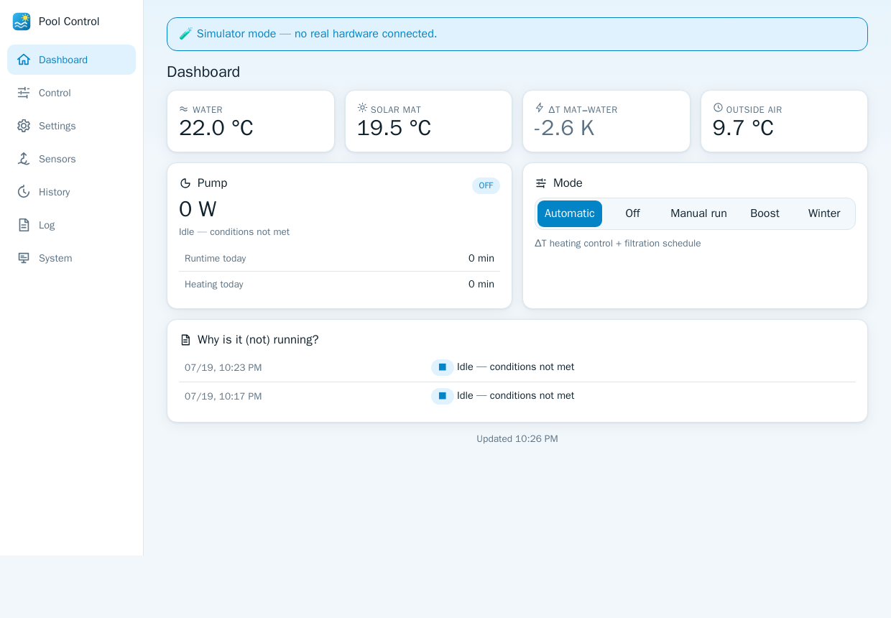

# 🏊 Shelly Pool Control

<picture>
  <source media="(prefers-color-scheme: dark)" srcset="docs/icon-dark.png">
  
</picture>

[](https://github.com/steiner-dominik/shelly-pool-control/actions/workflows/build.yml)
[](https://github.com/steiner-dominik/shelly-pool-control/releases)
[](LICENSE)
[](https://github.com/steiner-dominik/shelly-pool-control/pkgs/container/shelly-pool-control)

[](https://github.com/sponsors/steiner-dominik)
[](https://ko-fi.com/dominik_steiner)
[](https://buymeacoffee.com/dominik.st)

**A complete solar pool heating controller built on a Shelly 2PM/1PM Gen2+
with the Sensor Add-On: the safety-critical ΔT control loop runs entirely
on the Shelly (no network needed), while a modern web panel in Docker adds
monitoring, configuration, history, users, notifications and backups.**

> ⚠️ **This is an independent community project. It is not affiliated with,
> endorsed by, or supported by Shelly Group / Allterco Robotics in any way.**
> "Shelly" is used here solely to describe which devices the software works
> with.

> ⚠️ **Safety notice:** this software switches a real pump. Read the
> [rollout checklist](docs/ROLLOUT.md) before connecting hardware, configure
> the Shelly's built-in overpower/overtemperature protections as a backstop,
> and never rely on any single layer of protection.

It replaces a legacy solar pool controller: when the solar mat on the roof is
a configurable ΔT warmer than the pool water, the pump circulates water
through the mat until the gain is gone or the target temperature is reached —
plus daily filtration quota, frost protection, stagnation cooling, pump
dry-run protection and fully policy-driven fault handling.

<p align="center">
  <picture>
    <source media="(prefers-color-scheme: dark)" srcset="docs/screenshot-dark.png">
    
  </picture>
  <br>
  <sub>The panel follows your system's light/dark theme — so does this screenshot (simulator data shown).</sub>
</p>

---

## ✨ Features

- 🧠 **Control runs on the Shelly, not the server** — a mJS script on the
  device makes every pump decision from local sensors and local config.
  WiFi down? Server down? Internet down? The pool keeps running.
- 🛡 **Engineered like it matters**: sensor validation (range,
  rate-of-change, DS18B20 85 °C boot filter), redundant probe pairs with
  divergence policies, pump power signature monitoring (dry run / overload /
  no power / welded relay), mat overtemperature handling, frost protection,
  boot settle time, watchdog script that restarts a hung control script and
  forces the pump off as last resort
- 🧪 **One decision core, two implementations, one truth**: the control
  logic is specified as [pure functions](shared/logic-spec.md) and
  implemented in both Python (server/simulator) and mJS (device). A shared
  [test-vector suite](shared/test-vectors) runs against **both** in CI —
  covering every fault class and edge case
- ⚙️ **Everything configurable from the panel** — thresholds, windows,
  filtration quota, fault *policies* (safe-off vs. fallback schedule vs.
  degraded operation), retry behavior, all with units, ranges, defaults and
  inline help. Changes are validated, revision-stamped and only marked
  *confirmed* once the device echoes them back
- 📱 **Modern panel**: mobile-first, installable as a **PWA**, live updates
  via WebSocket, decision feed ("why is it (not) running?"), full history
  charts, fault & audit journals with CSV export
- 🌗 **Dark / light / auto** theme and 🌍 **English & German** — both
  following your system by default, both switchable in the UI
  ([add your language](docs/TRANSLATIONS.md) with a single JSON file)
- 🔒 **Security built in**: argon2id passwords, server-side sessions, CSRF
  protection, login rate limiting, optional TOTP 2FA, roles
  (admin / operator / viewer), immutable audit log, reverse-proxy aware
- 💾 **Backups**: one-click zip (settings + users + full history), scheduled
  daily backups with rotation, restore from the panel — parameters are pushed
  back to the device automatically
- 🏠 **Home Assistant, twice, both optional**: install the panel as a
  [Home Assistant app](https://github.com/steiner-dominik/home-assistant-apps)
  with ingress, and/or point it at an MQTT broker to get native HA entities
  via MQTT Discovery (mode select, temperatures, power, manual run…)
- 📈 Optional **InfluxDB v2 mirror** of all telemetry (SQLite stays
  authoritative — perfect for existing Grafana setups)
- 🧰 **Simulator included**: `POOL_SIMULATE=1` runs the whole panel against a
  simulated pool with fault injection — try everything without hardware
- 📦 CalVer releases (`YYYY.MM.DD.N`), multi-arch images on GHCR, automatic
  cache invalidation so the PWA reloads itself after every release

## 🔍 How it works

```
                 ┌──────────────────────────────────────────────┐
                 │ Shelly 2PM/1PM Gen2+  (control authority)    │
                 │  pool-control.js  ← decision core (mJS)      │
                 │  pool-watchdog.js ← liveness guard           │
 5× DS18B20 ────▶│  KVS: parameters + persisted state           │──── relay ──▶ pump
 (Add-On)        └──────────────▲───────────────────────────────┘
                                │ HTTP RPC (LAN): status / commands / KVS
                 ┌──────────────┴───────────────────────────────┐
                 │ Panel container (this repo)                  │
                 │  FastAPI + SQLite + Svelte PWA               │
                 │  auth · config · history · backups · notify  │
                 └──────┬───────────────┬───────────────────────┘
                        │ optional      │ optional
                        ▼               ▼
                   InfluxDB v2     MQTT → Home Assistant Discovery
```

The server never switches the pump directly — it sends *requests* that the
on-device script validates against its own interlocks. The one exception is
the emergency stop, which **additionally** forces the relay off directly
(belt and braces, and it can only ever turn the pump *off*).

## 🚀 Quick start (no hardware needed)

```bash
mkdir pool-control && cd pool-control
curl -LO https://github.com/steiner-dominik/shelly-pool-control/releases/latest/download/docker-compose.example.yml
curl -Lo .env https://github.com/steiner-dominik/shelly-pool-control/releases/latest/download/env.example
# set POOL_SIMULATE=1 in .env for a first look
docker compose -f docker-compose.example.yml up -d
```

Open `http://localhost:8080`, create the admin account, done. Flip
`POOL_SIMULATE` back to `0` and set `POOL_SHELLY_HOST` once your device is
ready.

## 📲 Installing the Shelly scripts

Requirements: Shelly 2PM or 1PM (Gen2 or newer), Shelly Sensor Add-On, up to
5 DS18B20 probes (2× water, 2× mat, 1× air recommended — fewer works too).

```bash
node shelly/build.mjs                       # bundles + size-checks the scripts
node shelly/deploy.mjs --host 192.168.1.50 --password '…'
```

or copy `pool-control.js` and `pool-watchdog.js` from the release asset
`dist-shelly-scripts.zip` into the Shelly web UI (Scripts → Add script),
enable **run on boot** for both. Then follow
[docs/INSTALL.md](docs/INSTALL.md) for sensor mapping, pump calibration and
the German [rollout checklist](docs/ROLLOUT.md).

## ⚙️ Server configuration

Configuration is environment-only (see
[`deploy/env.example`](deploy/env.example) for the full commented list):

| Variable | Default | Description |
|---|---|---|
| `POOL_SHELLY_HOST` | – | IP/hostname of the Shelly |
| `POOL_SHELLY_PASSWORD` | – | device admin password (enable device auth!) |
| `POOL_POLL_SECONDS` | `5` | status poll interval |
| `POOL_SIMULATE` | `0` | built-in simulator instead of hardware |
| `POOL_TRUSTED_PROXIES` | – | proxy IPs/CIDRs allowed to set `X-Forwarded-*` |
| `POOL_SESSION_TTL` | 14 days | session lifetime (seconds) |
| `POOL_INFLUX_URL/TOKEN/ORG/BUCKET` | – | optional InfluxDB v2 mirror |
| `POOL_MQTT_HOST/PORT/USER/PASSWORD/TLS/PREFIX` | – | optional HA discovery bridge |

Everything else — control parameters, fault policies, sensor mapping,
notification channels, backup schedule — lives in the panel.

## 🔐 Security notes

- Designed to sit behind a **TLS-terminating reverse proxy**; the app itself
  speaks plain HTTP and sets `Secure` cookies automatically when the request
  arrived via HTTPS (`X-Forwarded-Proto`).
- No secrets are baked into the image or repo; all secrets come from the
  environment or the panel (stored in the SQLite volume).
- The device should have **authentication enabled**; the panel talks digest
  auth to it.
- Consider an IP allowlist / geo restriction at the proxy for the exposed
  panel — defense in depth.
- Found something? See [SECURITY.md](SECURITY.md).

## 🏠 Home Assistant

- **Panel as HA app:** add
  [`steiner-dominik/home-assistant-apps`](https://github.com/steiner-dominik/home-assistant-apps)
  as an app repository and install *Shelly Pool Control*. Ingress handles
  login (role configurable), the same container image is used.
- **Native entities:** configure `POOL_MQTT_*` (any mode, standalone too) and
  a *Pool Heating* device appears via MQTT Discovery — temperatures, ΔT,
  pump state & power, runtime, mode `select`, manual-run button. Commands go
  through the same validated path as the panel.

## 🗓 Releases & versioning

CalVer `YYYY.MM.DD.N` (UTC date + counter for same-day releases). Every push
to `main` runs the full test suite (shared vectors against **both** decision
cores, backend tests, script size check), builds the multi-arch image,
creates the GitHub release with `docker-compose.example.yml`, `env.example`
and `dist-shelly-scripts.zip` attached, and publishes
`ghcr.io/steiner-dominik/shelly-pool-control:<version>`. The PWA checks
`/api/version` and reloads itself (purging all caches) when the server was
updated.

## 🛠 Development

```bash
python3 -m venv .venv && .venv/bin/pip install -r server/requirements.txt -r server/requirements-dev.txt
.venv/bin/python -m pytest server/tests        # backend + shared vectors (Python core)
node shelly/test/run-vectors.mjs               # shared vectors (mJS core)
node shelly/build.mjs                          # bundle + size check
cd frontend && npm install && npm run dev      # panel dev server (proxies to :8080)
```

Repository layout: `shared/` (normative logic spec + test vectors),
`shelly/` (device scripts + tooling), `server/` (FastAPI backend),
`frontend/` (Svelte PWA), `deploy/` (compose + env), `ha-app/` (Home
Assistant packaging), `docs/` (install, rollout, fault reference).

## 📄 License

[MIT](LICENSE) — © Dominik Steiner
